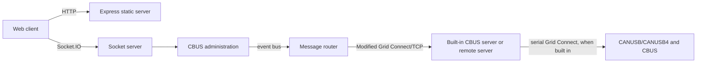

# MMC-SERVER architecture

This guide explains how the server in this repository is put together. It does
not cover the web client files in `public/`; their source code is held in the
MMC-CLIENT repository.

Read in this order:

1. [Components and dependencies](components.md) — boundaries and ownership.
2. [Runtime flows](runtime-flows.md) — startup, commands, events, and reconnects.
3. [CBUS domain](cbus-domain.md) — terms used by the server and protocol code.
4. [Extending the server](extending-the-server.md) — focused change recipes.

## At a glance

MMC-SERVER serves the existing web client over HTTP and exposes a separate
Socket.IO server for client commands and updates. Its CBUS administration layer
encodes, queues, and interprets CBUS messages. Messages travel as Modified Grid
Connect strings over TCP, either to the built-in serial bridge or to a remote
compatible server.

The important direction is:

`configuration` is shared infrastructure rather than a layer in that chain: it
owns persisted application/layout data and the event bus used to join the
components.

## Scope and source of truth

The web client bundle is served from `public/`; its source code is in the
MMC-CLIENT repository. Therefore, Socket.IO event names and payloads are
established by the handlers in `VLCB-server/socketServer.js` and their tests,
not by this documentation alone. CBUS encode/decode behaviour comes from
`cbuslibrary`.

For setup and test commands, see [../../TESTING.md](../../TESTING.md). For
contribution expectations, see [../../CONTRIBUTING.md](../../CONTRIBUTING.md).
