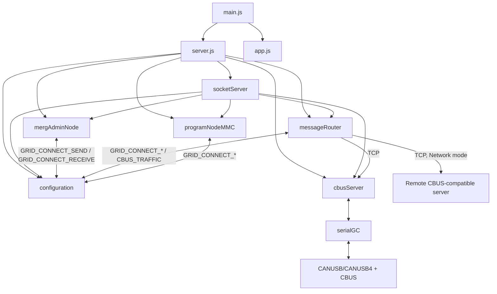

# Components and dependencies

## Runtime components

| Area | Main files | Responsibility |
| --- | --- | --- |
| Process and HTTP entry | `main.js`, `app.js` | Clears `logs/` at process start, starts the VLCB services, then starts Express to serve `public/` (default HTTP port 3000, overridable by `MMC_SERVER_HTTP_PORT`). |
| Service composition | `VLCB-server/server.js` | Creates one configuration, CBUS server, message router, administration node, programmer, and Socket.IO server; Socket.IO is configured on port 5552. |
| Client boundary | `VLCB-server/socketServer.js` | Registers Socket.IO commands, forwards domain updates and event-bus notifications to clients, and starts a separate HTTP/Socket.IO listener. |
| CBUS administration | `VLCB-server/mergAdminNode.js` | Maintains discovered nodes/events, dispatches decoded standard CBUS opcodes, queues outbound CBUS frames, and emits client-facing model changes. |
| Transport client | `VLCB-server/messageRouter.js` | Connects to the selected Grid Connect TCP endpoint, translates TCP data into event-bus traffic, logs traffic, and retries network connections. |
| Built-in transport | `VLCB-server/cbusServer.js`, `serialGC.js` | Offers a local TCP Grid Connect endpoint (port 5550) and bridges its clients to one serial CANUSB/CANUSB4 connection; serial input is broadcast to TCP clients. |
| Persistent/shared services | `VLCB-server/configuration.js` | Creates storage directories, reads/writes settings, layouts, node data and descriptors, writes logs, and owns the shared `EventEmitter` event bus. |
| Special protocol services | `longMessage.js`, `programNodeMMC.js` | Handle CBUS long messages and bootloader/Intel HEX programming respectively. |

## Dependency map

Arrows show runtime dependency or message flow. Lower-level transport code does
not import the Socket.IO layer.

The arrows through `configuration` represent named `eventBus` events, not a
generic service locator. For example, `mergAdminNode` emits
`GRID_CONNECT_SEND`; `messageRouter` subscribes and writes it to TCP.

## Connection modes

`START_CONNECTION` selects the endpoint at runtime.

| Mode | Endpoint selected by `socketServer` | Serial bridge |
| --- | --- | --- |
| `Network` | Supplied host and `hostPort` | Not started by this command. |
| `SerialPort` | Localhost:5550 | Built-in bridge connects to the supplied serial path. |
| Other/Auto | Localhost:5550 | Built-in bridge searches for recognised CANUSB/CANUSB4 USB IDs. |

The Socket.IO server starts before a bus connection is selected. `status.mode`
becomes `RUNNING` only after the router connects and the administration node's
`onConnect` completes.
