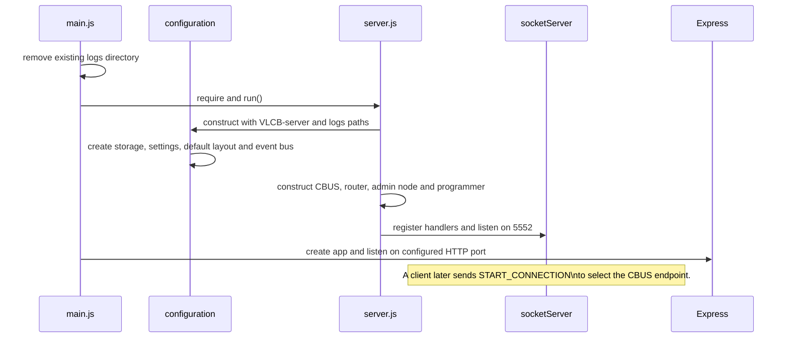
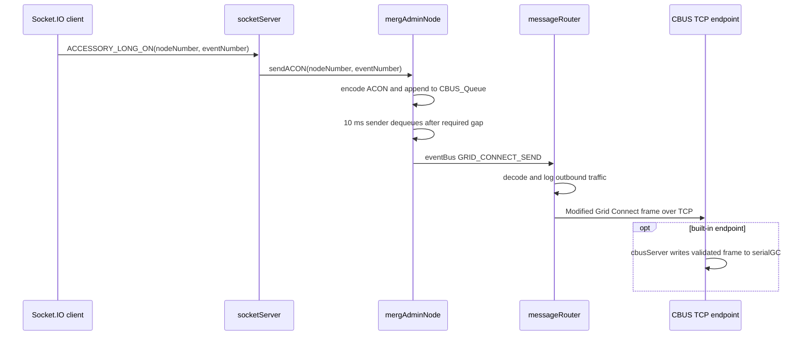
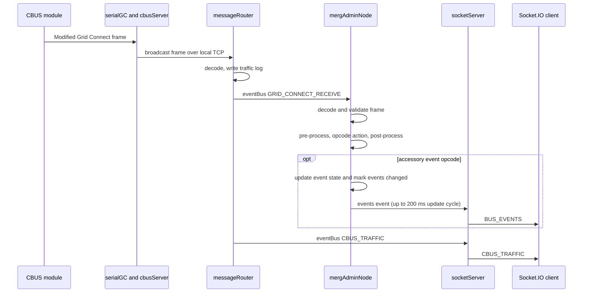
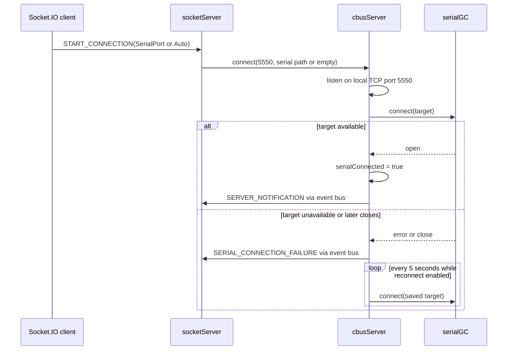

# Runtime flows

These diagrams intentionally use representative messages rather than claiming
that every command follows the same path.

## Process startup

## Client command: accessory long on

`ACCESSORY_LONG_ON` is a concrete example. The analogous command uses
`sendACOF` for an off event.

## Inbound CBUS event or message

For a locally bridged bus, serial input enters `cbusServer`; in Network mode a
remote endpoint sends the frame directly to `messageRouter`.

Opcode dispatch is in the `actions` table in `mergAdminNode.js`. Pre- and
post-processing also create/update node records and may queue follow-up
parameter or event requests.

## Serial connection and reconnect

`messageRouter` has a separate 5-second reconnect loop for its TCP endpoint
after a router error. The two mechanisms are independent: the bridge reconnects
to serial hardware, while the router reconnects to the selected TCP service.
